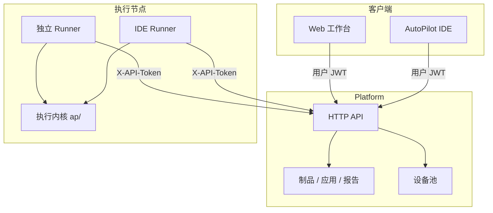
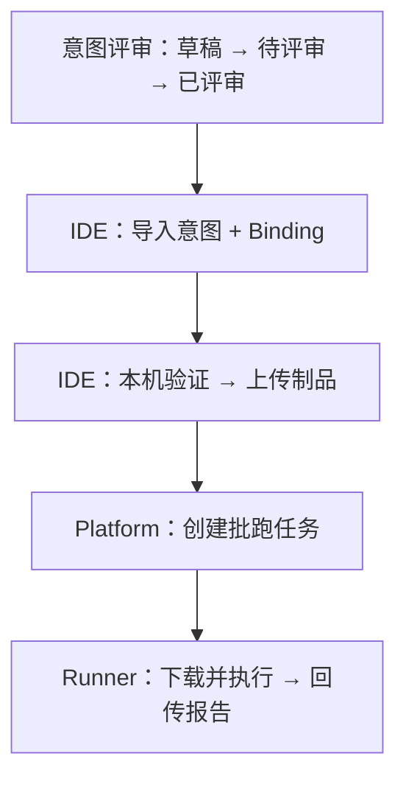

<div align="center">


# AutoPilot Platform

**企业测试治理与实验室资源管理平台**

[](https://python.org)
[](https://fastapi.tiangolo.com/)
[](https://vuejs.org)
[](https://www.sqlalchemy.org/)

[中文](README.md) · [English](README_en.md)

**[操作指南](docs/setup/managementconsole.md)** · **[OpenAPI](http://127.0.0.1:8000/docs)** · **[IDE 对接](docs/architecture/IDE_INTEGRATION.md)** · **[领域边界](docs/architecture/DOMAIN_BOUNDARIES.md)**

</div>

AutoPilot Platform 是 AutoPilot 自动化体系的服务端与 Web 工作台，面向组织提供测试设计评审、工程制品与应用版本管理、远程批跑调度、报告归档及实验室设备统一治理等能力。与 [AutoPilot IDE](../AutoPilot/README.md) 配套使用，支撑测试团队从设计到执行、从本机到实验室的标准化交付。

---

## 产品亮点

* **规范化的测试设计管理** — 意图用例全生命周期管理（草稿、评审、发布），可选 AI 辅助生成候选方案，保障设计过程可追溯、可管控。
* **远程批跑与报告治理** — 统一的任务调度、计划执行与报告归档，支持历史结果对比与审计，满足规模化回归与质量复盘需求。
* **实验室设备统一纳管** — 集中管理独立 Runner 与 IDE Runner 接入的真机资源，提供 Android / iOS 远控与会话治理，提升设备利用率与使用规范。
* **多租户与权限体系** — 基于组织与项目空间的分级权限模型，用户与执行节点分通道鉴权，适配企业多团队协同场景。
* **与 IDE 协同交付** — IDE 侧完成编排与本机验证，Platform 侧负责评审、调度与归档，分工清晰、流程闭环。
* **灵活部署，平滑扩展** — 支持本地快速联调与企业级生产部署（PostgreSQL、对象存储、分布式 Runner 节点等）。

---

## 快速开始

> [!WARNING]
> 下列账户与 Token **仅用于 `127.0.0.1` 本机开发**。`start_dev.py` 不是生产入口；生产须轮换密钥并设置 `MC_ENV=production`。

### 1. 启动工作台与 API

```powershell
# Windows
py -3.12 -m venv .venv
.\.venv\Scripts\python.exe -m pip install -U pip
.\.venv\Scripts\python.exe -m pip install -e ".[dev,runner]"
Push-Location autopilot_platform\frontend; npm install; Pop-Location

# 新克隆 / 没有 data/ 目录时：先建仓（主库 + 向量索引 + 初始 admin）
.\.venv\Scripts\python.exe tools\init_platform.py init

.\.venv\Scripts\python.exe start_dev.py
```

```bash
# Linux / macOS
python3.12 -m venv .venv
./.venv/bin/python -m pip install -U pip
./.venv/bin/python -m pip install -e ".[dev,runner]"
(cd autopilot_platform/frontend && npm install)

# 新克隆 / 没有 data/ 目录时：先建仓
./.venv/bin/python tools/init_platform.py init

./.venv/bin/python start_dev.py
```

| 入口 | 地址 |
| :--- | :--- |
| 工作台 | http://127.0.0.1:5173 |
| OpenAPI | http://127.0.0.1:8000/docs |
| 初始管理员 | `admin` / `admin`（仅 loopback） |

本地运行时数据默认在仓库根 **`data/`**（已 gitignore，需自行初始化）：

| 路径 | 说明 |
| :--- | :--- |
| `data/autopilot_platform.db` | 主业务库 |
| `data/rag_index/vectors.sqlite` | 知识库向量索引 |
| `data/mc_runtime_config.json` | Web 运维运行时覆盖（可为 `{}`） |

- **首次 / 删过 `data/`**：`tools/init_platform.py init`
- **清库重来（开发）**：`tools/init_platform.py fresh --yes`
- **查看状态**：`tools/init_platform.py status`

详见 [tools/README.md](tools/README.md)。

### 2. 启动独立 Runner

`start_dev.py` **不会**启动执行节点。另开终端：

```powershell
$env:MC_RUNNER_TOKEN = "<your-runner-token>"
python -m autopilot_platform.runner --server http://127.0.0.1:8000 --token-env MC_RUNNER_TOKEN
```

设备页出现本机 USB 设备后，即可在 Web 工作台创建批跑任务。与 IDE 联调：IDE 登录同一 Platform → 上传工程制品 → 提交远程任务。

完整步骤见 [操作指南](docs/setup/managementconsole.md)。

---

## 系统一览

| 组件 | 说明 |
| :--- | :--- |
| Web 工作台 | 组织与项目、测试设计、制品与应用、批跑与计划、报告、设备与远控 |
| Platform 服务 | 身份与权限、领域 API、调度与存储 |
| 独立 Runner | 命令行执行节点，负责领取任务并在本机执行 |
| IDE Runner | 由 AutoPilot IDE 启动的执行节点 |
| 执行引擎 | 在 Runner 节点本地执行用例并回传结果 |

Platform 为 Web 工作台与 IDE 提供统一后端；执行节点就近接入真机资源，完成制品下载、用例执行与报告回传。

---

## 与 IDE 协同

| 能力 | AutoPilot IDE | AutoPilot Platform |
| :--- | :--- | :--- |
| 用例编排 | 主责 | 浏览 / 治理 |
| Binding 与定位器 | 主责 | 随制品保存 |
| 本机调试 | 主责 | — |
| 意图设计与评审 | 导入、绑定 | 主责 |
| 远程批跑 | 提交与查看 | 调度、治理 |
| 设备资源 | IDE Runner | 设备池 + 独立 Runner |
| 测试报告 | 本机生成 | 归档、对比、审计 |

详细分工见 [领域边界](docs/architecture/DOMAIN_BOUNDARIES.md) 与 [IDE 对接](docs/architecture/IDE_INTEGRATION.md)。

---

## 可选组件

| Extra | 用途 |
| :--- | :--- |
| `design` | 设计域 LLM |
| `runner_remote` | 远控能力 |
| `web_playwright` | Playwright 浏览器引擎 |
| `pg` · `s3` | PostgreSQL · 对象存储 |

命令入口：`ap-platform`、`ap-runner`。

---

## 仓库结构

```
autopilot_platform/
  platform/     领域服务与 HTTP API
  frontend/     Vue 3 工作台
  runner/       独立 Runner
  ap/           执行内核副本
contracts/      JSON Schema / OpenAPI / RUNTIME_PIN
docs/           架构、操作与配置
```

---

<details>
<summary><strong>架构细节、鉴权、部署与治理</strong></summary>

### 组件与数据流



### 端到端工作流



### 版本兼容

请按 IDE 与 Platform 发布说明配对使用；工程格式为 `.tc.yaml` / `.map.yaml`（兼容旧版 `.tc` / `.map`）。Integrator 细节见 [`RUNTIME_PIN`](contracts/RUNTIME_PIN) 与 [IDE 对接](docs/architecture/IDE_INTEGRATION.md)。

| IDE 版本 | Platform 版本 | 工程格式 | 状态 |
|----------|---------------|----------|------|
| 0.1.x | 0.2.x | `.tc.yaml` / `.map.yaml` | 当前开发线 |

### 支持矩阵

| 项目 | 最低 | 推荐 |
|------|------|------|
| Python | 3.10 | 3.12 |
| Node.js | 18 | 20 或 22 |
| PostgreSQL | 生产建议 | 当前主线 |
| JDK（Android Runner） | 17+ | 17+ |

真机运行时（JDK、Node、Appium、WDA）安装在 **Runner 所在机器**。详见 [Android](docs/setup/android.md) · [iOS](docs/setup/ios.md)。

### 鉴权与配置

启动时加载仓库根 `.env`（不覆盖已有进程环境）。样例：[`.env.example`](.env.example)；生产：[`deploy/production.env.example`](deploy/production.env.example)。

| 变量 | 开发默认 | 用途 |
|------|----------|------|
| `MC_HOST` / `MC_PORT` | `127.0.0.1` / `8000` | 监听地址 |
| `MC_API_TOKEN` | 见 `.env.example` | Runner 通道 |
| `MC_JWT_SECRET` | 开发默认值 | JWT 签名 |
| `MC_ADMIN_USER` / `MC_ADMIN_PASSWORD` | `admin` / `admin` | 引导管理员 |
| `MC_DATABASE_URL` | SQLite | 生产建议 PostgreSQL |

用户：`POST /api/v1/auth/login` → Bearer JWT；Runner：`X-API-Token`。

### 生产部署

**不要使用 `start_dev.py` 部署生产。** 操作清单：[生产部署安全基线](docs/setup/managementconsole.md#10-生产部署安全基线) — 反向代理与 TLS、ASGI 进程、PostgreSQL、密钥轮换、日志监控、调度租约。

### 多租户与资源隔离

| 资源 | 默认作用域 |
|------|------------|
| 工程制品 | 项目 |
| 应用安装包 | 项目（可按 ACL 分享） |
| 设备 | 组织 / 设备池 |
| 报告 | 项目 |

详见 [多租户](docs/architecture/MULTI_TENANCY.md)。

### 制品与报告保留

| 项 | 默认 | 变量 |
|----|------|------|
| 工程制品上限 | 512 MB | `MC_ARTIFACT_MAX_MB` |
| 工程制品保留 | 30 天 | `MC_ARTIFACT_RETENTION_DAYS` |
| 应用资源保留 | 90 天 | `MC_APP_BUILD_RETENTION_DAYS` |
| Job 报告保留 | 90 天 | `MC_JOB_REPORT_RETENTION_DAYS` |

工程 zip **不包含**安装包；任务可钉选应用版本。

### 调度与设备占用

计划调度为进程内 tick + 数据库租约（`ops_locks`），不引入独立 MQ。SQLite 适合单写联调；多写请用 PostgreSQL。详见 [调度 ADR](docs/architecture/ADR_scheduler_no_mq.md)。

同一设备同一时刻一名控制者；Runner 掉线由回收逻辑释放。详见 [远控](docs/REMOTE_PHASE3.md)。

### 术语

| 术语 | 定义 |
|------|------|
| 执行节点 Runner | 领取任务并执行的节点统称 |
| 独立 Runner | 本仓 CLI 执行进程 |
| IDE Runner | 由 AutoPilot IDE 启动的本机节点 |
| 设备池 | Platform 管理的设备资源集合 |
| 远控会话 | 针对已注册设备的独占或只读会话 |

</details>

---

## 文档

| 文档 | 说明 |
|------|------|
| [操作指南](docs/setup/managementconsole.md) | 本机联调、生产基线、分发 IDE |
| [配置真源](docs/CONFIGURATION.md) | 环境变量与 Bootstrap |
| [领域边界](docs/architecture/DOMAIN_BOUNDARIES.md) | 与 IDE 的产品分工 |
| [IDE 对接](docs/architecture/IDE_INTEGRATION.md) | 客户端集成清单 |
| [远控](docs/REMOTE_PHASE3.md) | 会话模型与网络要求 |
| [Android](docs/setup/android.md) · [iOS](docs/setup/ios.md) · [Web](docs/setup/web.md) | Runner 主机工具链 |

---

## 常见问题

**工作台看不到设备** — 先启动独立 Runner 或 IDE Runner；检查 adb / iOS 授权。

**多个 Runner 互相抢占** — 独立 Runner 与 IDE Runner 须使用不同 `--runner-id`。

**远程任务未安装应用** — 在任务中指定应用资源版本；工程制品只含用例与配置。

**`--lan` 或 `0.0.0.0` 启动失败** — 非 loopback 禁止开发默认凭据，须先按生产基线更换密钥。

---

## 许可证

详见 [LICENSE.txt](LICENSE.txt)。
