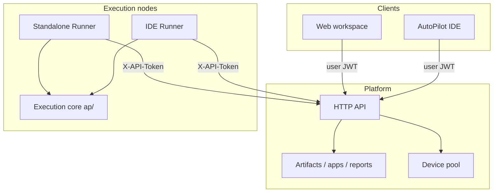
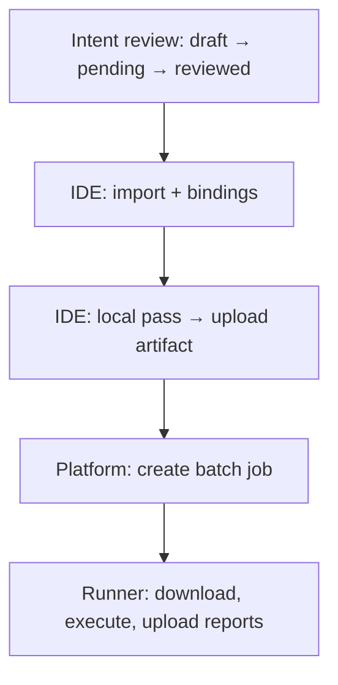

<div align="center">


# AutoPilot Platform

**Enterprise test governance and lab resource management**

[](https://python.org)
[](https://fastapi.tiangolo.com/)
[](https://vuejs.org)
[](https://www.sqlalchemy.org/)

[中文](README.md) · [English](README_en.md)

**[Operations guide](docs/setup/managementconsole.md)** · **[OpenAPI](http://127.0.0.1:8000/docs)** · **[IDE integration](docs/architecture/IDE_INTEGRATION.md)** · **[Domain boundaries](docs/architecture/DOMAIN_BOUNDARIES.md)**

</div>

AutoPilot Platform is the server and web workspace of the AutoPilot suite. It provides design review, versioned artifacts and app builds, remote batch scheduling, report archival, and unified lab device governance for organizations. It works with the [AutoPilot IDE](../AutoPilot/README_en.md) to standardize delivery from design through execution—from local workstations to the lab.

---

## Product highlights

* **Governed test design** — Full lifecycle management for intent cases (draft, review, release), with optional AI-assisted drafts; design workflows stay traceable and auditable.
* **Remote batch execution and report governance** — Unified scheduling, planned runs, and report archival with historical comparison—built for large regression and quality review.
* **Centralized lab device management** — Standalone and IDE Runners register into one inventory; Android / iOS remote control with session governance for better utilization and policy compliance.
* **Multi-tenant access control** — Organization- and project-scoped permissions with separate auth channels for users and execution nodes—ready for multi-team enterprise use.
* **Coordinated IDE delivery** — Author and validate locally in the IDE; review, schedule, and archive on Platform—with clear roles and a closed workflow.
* **Flexible deployment** — Quick local setup for integration testing; production options include PostgreSQL, object storage, and distributed Runner hosts.

---

## Get started

> [!WARNING]
> Default accounts and tokens below are **for `127.0.0.1` development only**. `start_dev.py` is not a production entry point; rotate secrets and set `MC_ENV=production` for real deployments.

### 1. Start the workspace and API

```powershell
# Windows
py -3.12 -m venv .venv
.\.venv\Scripts\python.exe -m pip install -U pip
.\.venv\Scripts\python.exe -m pip install -e ".[dev,runner]"
Push-Location autopilot_platform\frontend; npm install; Pop-Location

# New clone / missing data/: initialize storage first
.\.venv\Scripts\python.exe tools\init_platform.py init

.\.venv\Scripts\python.exe start_dev.py
```

```bash
# Linux / macOS
python3.12 -m venv .venv
./.venv/bin/python -m pip install -U pip
./.venv/bin/python -m pip install -e ".[dev,runner]"
(cd autopilot_platform/frontend && npm install)

# New clone / missing data/: initialize storage first
./.venv/bin/python tools/init_platform.py init

./.venv/bin/python start_dev.py
```

| Entry | URL |
| :--- | :--- |
| Workspace | http://127.0.0.1:5173 |
| OpenAPI | http://127.0.0.1:8000/docs |
| Bootstrap admin | `admin` / `admin` (loopback only) |

Runtime data lives under **`data/`** at the repo root (gitignored). Run `tools/init_platform.py init` on first setup or after deleting `data/`. Dev reset: `fresh --yes`. See [tools/README.md](tools/README.md).

### 2. Start a standalone Runner

`start_dev.py` does **not** start an execution node. In a second terminal:

```powershell
$env:MC_RUNNER_TOKEN = "<your-runner-token>"
python -m autopilot_platform.runner --server http://127.0.0.1:8000 --token-env MC_RUNNER_TOKEN
```

Once local USB devices appear on the device board, create batch jobs from the web workspace. Pair with the IDE: sign in to the same Platform → upload artifacts → submit remote jobs.

Full walkthrough: [operations guide](docs/setup/managementconsole.md).

---

## At a glance

| Component | Description |
| :--- | :--- |
| Web workspace | Organizations, projects, design, artifacts and apps, jobs and schedules, reports, devices and remote control |
| Platform service | Identity, domain APIs, scheduling, and storage |
| Standalone Runner | CLI execution node that claims jobs and runs them locally |
| IDE Runner | Execution node started from AutoPilot IDE |
| Execution engine | Runs cases on Runner hosts and returns results |

Platform is the shared backend for the web workspace and IDE. Execution nodes attach near devices to download artifacts, run cases, and upload reports.

---

## Works with the IDE

| Capability | AutoPilot IDE | AutoPilot Platform |
| :--- | :--- | :--- |
| Case authoring | Primary | Browse / govern |
| Bindings and locators | Primary | Stored with artifact |
| Local debugging | Primary | — |
| Intent design and review | Import, bind | Primary |
| Remote batch runs | Submit and observe | Schedule and govern |
| Device resources | IDE Runner | Pool + standalone Runner |
| Test reports | Generated locally | Archive, compare, audit |

See [domain boundaries](docs/architecture/DOMAIN_BOUNDARIES.md) and [IDE integration](docs/architecture/IDE_INTEGRATION.md).

---

## Optional extras

| Extra | Purpose |
| :--- | :--- |
| `design` | Design-domain LLM |
| `runner_remote` | Remote control |
| `web_playwright` | Playwright browser engine |
| `pg` · `s3` | PostgreSQL · object storage |

CLI entry points: `ap-platform`, `ap-runner`.

---

## Layout

```
autopilot_platform/
  platform/     Domain services and HTTP API
  frontend/     Vue 3 workspace
  runner/       Standalone Runner
  ap/           Execution-core copy
contracts/      JSON Schema / OpenAPI / RUNTIME_PIN
docs/           Architecture, operations, configuration
```

---

<details>
<summary><strong>Architecture, auth, deployment, and governance</strong></summary>

### Components and data flow



### End-to-end workflow



### Version compatibility

Pair IDE and Platform releases per their release notes; project format is `.tc.yaml` / `.map.yaml`. Integrator details: [`RUNTIME_PIN`](contracts/RUNTIME_PIN) and [IDE integration](docs/architecture/IDE_INTEGRATION.md).

| IDE version | Platform version | Project format | Status |
|-------------|------------------|----------------|--------|
| 0.1.x | 0.2.x | `.tc.yaml` / `.map.yaml` | Current dev line |

### Support matrix

| Item | Minimum | Recommended |
|------|---------|-------------|
| Python | 3.10 | 3.12 |
| Node.js | 18 | 20 or 22 |
| PostgreSQL | recommended for prod | current mainline |
| JDK (Android Runner) | 17+ | 17+ |

Device runtimes (JDK, Node, Appium, WDA) live on the **Runner host**. See [Android](docs/setup/android.md) · [iOS](docs/setup/ios.md).

### Auth and configuration

Loads `.env` at repo root on startup (does not override existing process env). Samples: [`.env.example`](.env.example); production: [`deploy/production.env.example`](deploy/production.env.example).

| Variable | Dev default | Purpose |
|----------|-------------|---------|
| `MC_HOST` / `MC_PORT` | `127.0.0.1` / `8000` | Listen address |
| `MC_API_TOKEN` | see `.env.example` | Runner channel |
| `MC_JWT_SECRET` | dev default | JWT signing |
| `MC_ADMIN_USER` / `MC_ADMIN_PASSWORD` | `admin` / `admin` | Bootstrap admin |
| `MC_DATABASE_URL` | SQLite | PostgreSQL for production |

Users: `POST /api/v1/auth/login` → Bearer JWT; Runners: `X-API-Token`.

### Production deployment

**Do not use `start_dev.py` in production.** Checklist: [production security baseline](docs/setup/managementconsole.md#10-生产部署安全基线) — reverse proxy and TLS, ASGI workers, PostgreSQL, secret rotation, logging, scheduler lease.

### Multi-tenancy and isolation

| Resource | Default scope |
|----------|---------------|
| Project artifacts | Project |
| App builds | Project (shareable via ACL) |
| Devices | Org / device pool |
| Reports | Project |

See [multi-tenancy](docs/architecture/MULTI_TENANCY.md).

### Artifact and report retention

| Item | Default | Variable |
|------|---------|----------|
| Artifact upload limit | 512 MB | `MC_ARTIFACT_MAX_MB` |
| Artifact retention | 30 days | `MC_ARTIFACT_RETENTION_DAYS` |
| App build retention | 90 days | `MC_APP_BUILD_RETENTION_DAYS` |
| Job report retention | 90 days | `MC_JOB_REPORT_RETENTION_DAYS` |

Project zips **do not** include app packages; jobs can pin an app build version.

### Scheduling and device occupancy

In-process tick + DB lease (`ops_locks`); no separate message queue. SQLite for single-writer dev; PostgreSQL for multi-writer. See [scheduler ADR](docs/architecture/ADR_scheduler_no_mq.md).

One controller per device at a time; Runner disconnect triggers reclaim. See [remote control](docs/REMOTE_PHASE3.md).

### Terminology

| Term | Definition |
|------|------------|
| Execution node (Runner) | Any node that claims jobs and executes them |
| Standalone Runner | CLI process shipped in this repository |
| IDE Runner | Local node started by AutoPilot IDE |
| Device pool | Device inventory managed by Platform |
| Remote session | Exclusive or read-only session against a registered device |

</details>

---

## Documentation

| Doc | Description |
|-----|-------------|
| [Operations guide](docs/setup/managementconsole.md) | Local dev, production baseline, IDE distribution |
| [Configuration](docs/CONFIGURATION.md) | Environment variables and bootstrap |
| [Domain boundaries](docs/architecture/DOMAIN_BOUNDARIES.md) | Product split with the IDE |
| [IDE integration](docs/architecture/IDE_INTEGRATION.md) | Client integration checklist |
| [Remote control](docs/REMOTE_PHASE3.md) | Session model and networking |
| [Android](docs/setup/android.md) · [iOS](docs/setup/ios.md) · [Web](docs/setup/web.md) | Runner host toolchains |

---

## FAQ

**No devices on the board** — start a standalone or IDE Runner first; check adb / iOS authorization.

**Runners steal each other’s jobs** — standalone and IDE Runners must use different `--runner-id` values.

**Remote job did not install the app** — specify an app build version in the job; artifacts contain cases and config only.

**`--lan` or `0.0.0.0` startup fails** — non-loopback binding rejects dev defaults; rotate secrets per the production baseline first.

---

## License

See [LICENSE.txt](LICENSE.txt).
